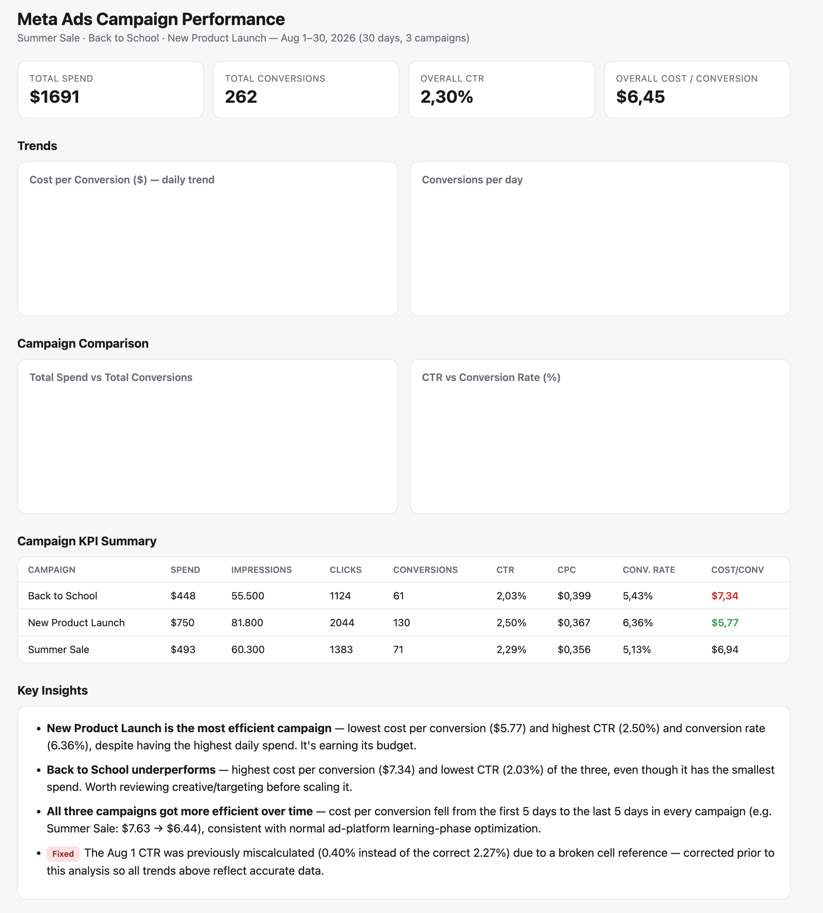

# Meta Ads Reporting Portfolio

End-to-end Meta Ads reporting project covering data validation, KPI analysis, campaign performance, and dashboard reporting — built with Claude.

**Dataset:** 30 days of synthetic Meta Ads data across 3 campaigns (*Summer Sale*, *Back to School*, *New Product Launch*).

## 📁 Repo Contents

| File | Description |
|---|---|
| [`meta_ads_campaign_data.xlsx`](./meta_ads_campaign_data.xlsx) | Cleaned, formula-corrected source workbook |
| [`meta.html`](./meta.html) | Standalone interactive dashboard (open directly in a browser) |
| [`dashboard.png`](./dashboard.png) | Dashboard screenshot |
| [`Meta Ads Campaign Performance...`](./Meta%20Ads%20Campaign%20Performance%20Audit%20%26%20Dashboard.md) | Full project write-up / case study |

## 🔍 Data Quality Audit

Before building any reporting, every pre-calculated metric in the raw export (CTR, CPC, Conversion Rate, Cost per Conversion) was independently recalculated from the raw inputs and diffed against the sheet's cached values.

This caught a **broken formula**: the CTR cell for August 1st referenced the wrong cell (`=I17`, another row's CPC value) instead of `=F2/D2*100`, understating CTR as 0.40% instead of the correct **2.27%**. The formula was corrected, and the full workbook was recalculated to confirm zero errors across all 120 formulas before any analysis was built on top of it. Missing values, duplicate records, and formatting inconsistencies were also checked — the rest of the dataset was clean.

## 📊 KPIs

Campaign-level KPIs were calculated **spend-weighted** (not as simple row-averages, which distorts rates when daily volumes vary):

| Campaign | Spend | CTR | CPC | Conv. Rate | Cost / Conv |
|---|---|---|---|---|---|
| New Product Launch | $750 | 2.50% | $0.367 | 6.36% | **$5.77** ✅ |
| Summer Sale | $493 | 2.29% | $0.356 | 5.13% | $6.94 |
| Back to School | $448 | 2.03% | $0.399 | 5.43% | $7.34 ⚠️ |

## 📈 Dashboard

Interactive HTML dashboard (Chart.js) with KPI summary cards, daily trend lines for cost-per-conversion and conversions, campaign comparison bar charts, and a full KPI table.

Open [`meta.html`](./meta.html) locally to explore it live.

## 💡 Key Findings

- **New Product Launch was the most efficient campaign** — lowest cost per conversion ($5.77), highest CTR (2.50%), and highest conversion rate (6.36%), despite the largest daily budget.
- **Back to School underperformed** — highest cost per conversion ($7.34) and lowest CTR (2.03%), pointing to a creative or targeting issue worth reviewing before scaling spend.
- **All three campaigns became more efficient over time** — cost per conversion fell from the first half to the second half of every campaign's run (e.g. Summer Sale: $7.63 → $6.44), consistent with normal platform learning-phase optimization.

## 🛠 Tools & Skills Demonstrated

`Claude` · Excel/Spreadsheet auditing (`openpyxl`, `pandas`) · formula verification & recalculation · KPI design · data visualization (`Chart.js`) · HTML/CSS dashboard design · analytical storytelling · GitHub
